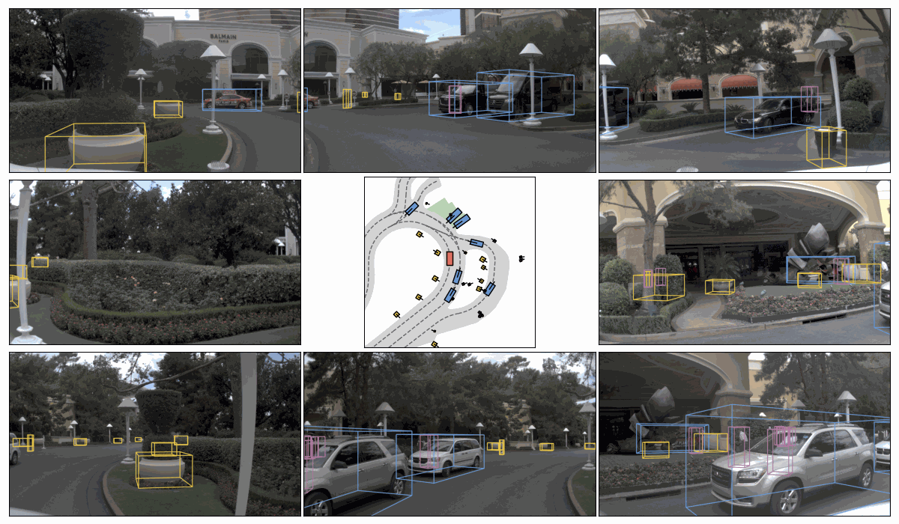

<div id="top" align="center">

<p align="center">
  
  <h2 align="center">Data-Driven Non-Reactive Autonomous Vehicle Simulation and Benchmarking</h1>
  <h3 align="center"><a href="https://arxiv.org/abs/2406.15349">Paper</a> | Supplementary | <a href="https://www.youtube.com/watch?v=Qe76HRmPDe0">Talk</a> | <a href="https://opendrivelab.com/challenge2024/#end_to_end_driving_at_scale">2024 Challenge</a> | <a href="https://huggingface.co/spaces/AGC2024-P/e2e-driving-navsim">Leaderboard</a>  </h3>
</p>

</div>

<br/>


> [**NAVSIM: Data-Driven Non-Reactive Autonomous Vehicle Simulation and Benchmarking**](https://arxiv.org/abs/2406.15349)
> 
> [Daniel Dauner](https://danieldauner.github.io/)<sup>1,2</sup>, [Marcel Hallgarten](https://mh0797.github.io/)<sup>1,5</sup>, [Tianyu Li](https://github.com/sephyli)<sup>3</sup>, [Xinshuo Weng](https://xinshuoweng.com/)<sup>4</sup>, [Zhiyu Huang](https://mczhi.github.io/)<sup>4,6</sup>, [Zetong Yang](https://scholar.google.com/citations?user=oPiZSVYAAAAJ)<sup>3</sup>\
> [Hongyang Li](https://lihongyang.info/)<sup>3</sup>, [Igor Gilitschenski](https://www.gilitschenski.org/igor/)<sup>7,8</sup>, [Boris Ivanovic](https://www.borisivanovic.com/)<sup>4</sup>, [Marco Pavone](https://web.stanford.edu/~pavone/)<sup>4,9</sup>, [Andreas Geiger](https://www.cvlibs.net/)<sup>1,2</sup>, and [Kashyap Chitta](https://kashyap7x.github.io/)<sup>1,2</sup>  <br>
> 
> <sup>1</sup>University of Tübingen, <sup>2</sup>Tübingen AI Center, <sup>3</sup>OpenDriveLab at Shanghai AI Lab, <sup>4</sup>NVIDIA Research\
> <sup>5</sup>Robert Bosch GmbH, <sup>6</sup>Nanyang Technological University, <sup>7</sup>University of Toronto, <sup>8</sup>Vector Institute, <sup>9</sup>Stanford University
>
<br/>


## Highlights <a name="highlight"></a>

🔥 NAVSIM gathers simulation-based metrics (such as progress and time to collision) for end-to-end driving by unrolling simplified bird's eye view abstractions of scenes for a short simulation horizon. It operates under the condition that the policy has no influence on the environment, which enables **efficient, open-loop metric computation** while being **better aligned with closed-loop** evaluations than traditional displacement errors. 

<p align="center">
  
</p>

## Table of Contents
1. [Highlights](#highlight)
2. [Getting started](#gettingstarted)
3. [Changelog](#changelog)
4. [License and citation](#licenseandcitation)
5. [Other resources](#otherresources)


## Getting started <a name="gettingstarted"></a>

- [Download and installation](docs/install.md)
- [Understanding and creating agents](docs/agents.md) 
- [Understanding the data format and classes](docs/cache.md)
- [Dataset splits vs. filtered training / test splits](docs/splits.md)
- [Understanding the PDM Score](docs/metrics.md)
- [Submitting to the Leaderboard](docs/submission.md)
  
<p align="right">(<a href="#top">back to top</a>)</p>


## Changelog <a name="changelog"></a>
- **`[2024/09/03]`** NAVSIM v1.1 release
  - Leaderboard for `navtest` on [Hugging Face](https://huggingface.co/spaces/AGC2024-P/e2e-driving-navsim)
  - Release of baseline checkpoints on [Hugging Face](https://huggingface.co/autonomousvision/navsim_baselines)
  - Updated docs for [submission](docs/submission.md) and [paper](https://arxiv.org/abs/2406.15349)
  - Code refactoring, formatting, minor fixes
- **`[2024/04/21]`** NAVSIM v1.0 release (official devkit version for [AGC 2024](https://opendrivelab.com/challenge2024/#end_to_end_driving_at_scale))
  - Parallelization of metric caching / evaluation
  - Adds [Transfuser](https://arxiv.org/abs/2205.15997) baseline (see [agents](docs/agents.md#Baselines))
  - Adds standardized training and test filtered splits (see [splits](docs/splits.md))
  - Visualization tools (see [tutorial_visualization.ipynb](tutorial/tutorial_visualization.ipynb))
- **`[2024/04/03]`** NAVSIM v0.4 release
  - Support for test phase frames of competition
  - Download script for trainval
  - Egostatus MLP Agent and training pipeline
- **`[2024/03/25]`** NAVSIM v0.3 release (official devkit version for warm-up phase)
  - Adds code for Leaderboard submission
- **`[2024/03/11]`** NAVSIM v0.2 release
  - Easier installation and download
  - mini and test data split integration
  - Privileged `Human` agent
- **`[2024/02/20]`** NAVSIM v0.1 release (initial demo)
  - OpenScene-mini sensor blobs and annotation logs
  - Naive `ConstantVelocity` agent


<p align="right">(<a href="#top">back to top</a>)</p>


## License and citation <a name="licenseandcitation"></a>
All assets and code in this repository are under the [Apache 2.0 license](./LICENSE) unless specified otherwise. The datasets (including nuPlan and OpenScene) inherit their own distribution licenses. Please consider citing our paper and project if they help your research.

```BibTeX
@article{Dauner2024ARXIV,
    title = {NAVSIM: Data-Driven Non-Reactive Autonomous Vehicle Simulation and Benchmarking},
    author = {Daniel Dauner and Marcel Hallgarten and Tianyu Li and Xinshuo Weng and Zhiyu Huang and Zetong Yang and Hongyang Li and Igor Gilitschenski and Boris Ivanovic and Marco Pavone and Andreas Geiger and Kashyap Chitta},
    journal = {arXiv},
    volume = {2406.15349},
    year = {2024}
} 
```

```BibTeX
@misc{Contributors2024navsim,
    title={NAVSIM: Data-Driven Non-Reactive Autonomous Vehicle Simulation and Benchmarking},
    author={NAVSIM Contributors},
    howpublished={\url{https://github.com/autonomousvision/navsim}},
    year={2024}
} 
```

<p align="right">(<a href="#top">back to top</a>)</p>


## Other resources <a name="otherresources"></a>

<a href="https://twitter.com/AutoVisionGroup" target="_blank">
    
  </a>
<a href="https://twitter.com/kashyap7x" target="_blank">
    
  </a>
<a href="https://twitter.com/DanielDauner" target="_blank">
    
  </a>
<a href="https://twitter.com/MHallgarten0797" target="_blank">
    
  </a>

- [SLEDGE](https://github.com/autonomousvision/sledge) | [tuPlan garage](https://github.com/autonomousvision/tuplan_garage) | [CARLA garage](https://github.com/autonomousvision/carla_garage) | [Survey on E2EAD](https://github.com/OpenDriveLab/End-to-end-Autonomous-Driving)
- [PlanT](https://github.com/autonomousvision/plant) | [KING](https://github.com/autonomousvision/king) | [TransFuser](https://github.com/autonomousvision/transfuser) | [NEAT](https://github.com/autonomousvision/neat)

<p align="right">(<a href="#top">back to top</a>)</p>
